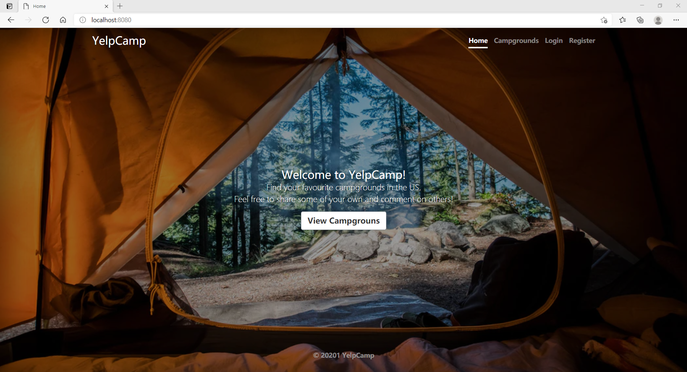

# YelpCamp
A Yelp-style web APP that displays the campgrounds in the US. It is the milestone project of [The Web Developer Bootcamp](https://www.udemy.com/course/the-web-developer-bootcamp/) on Udemy. Users can register accounts and then create and review campgrounds.

<p align="center">

</p>

<p align="center">

</p>

## Tech Stack
This project was based on Node.js, Express, MongoDB, and Bootstrap. Passport.js was used to handle authentication, and MapBox is used for visualizing maps.

## Local Demo
1. Install Mongodb:

2. Create a Cloudinary account to get an API key and secret code

3. Create a Mapbox account to get a mapbox token

3. Download the repo and install dependencies:
```
git clone https://github.com/shiwentao00/YelpCamp
cd YelpCamp
npm install
```

4. Create a .env file (or just export manually in the terminal) in the root of the project and add the following:
```
CLOUDINARY_CLOUD_NAME=<your Cloudinary name>
CLOUDINARY_KEY=<your Cloudinary key>
CLOUDINARY_SECRET=<your Cloudinary secret>
MAPBOX_TOKEN=<your MapBox token>
```  

5. Run mongod in another terminal and node app.js in the terminal with the project.
```
node app.js
```

6. Visit localhost:8080.
